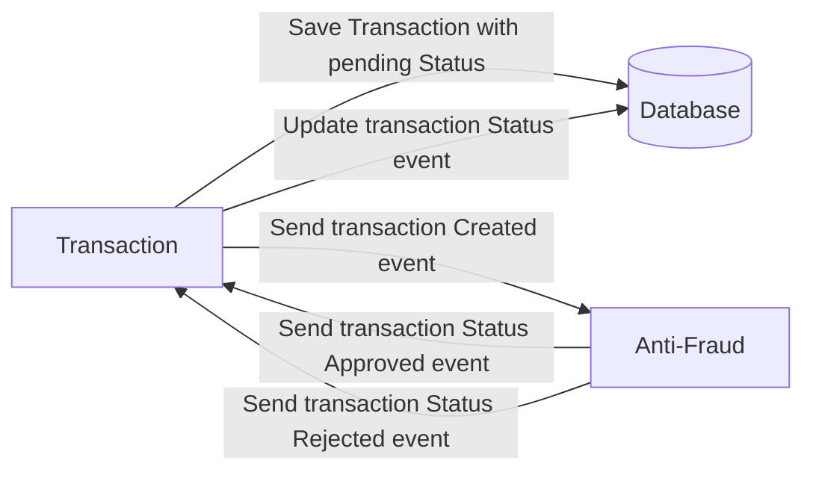

# Carrefour Code Challenge :rocket:
# Desenho Arquitetura (Diagrama Componentes)


Para definição arquitetural foi escolhido uma Arquitetura baseada em microsserviço para melhor escalabilidade e resiliência da aplicação, como primeiro ponto a ser observado defini que haveria uma interface de cadastro de transaction que ao receber a transaction popularia um tópico para trazer mais resiliência dos dados transacionados e suporte de uma volumetria maior para se houver concorrência de transação. Implementei como bônus uma sistema antifraude que possibilita ser um moderador de transação, o mesmo tem a função de validar e cadastrar a transação caso a mesmo passe por definições de segurança.


Para essa escolha foi escolhido a stack de ferramentas:
| Ferramenta  | Definição da escolha |
| ------------- | ------------- |
| Kuberbetes  | Oferece uma estrutura para executar sistemas distribuídos de forma resiliente  |
| Kafka  | Atua como um sistema de armazenamento muito escalável e tolerante a falhas, gravando e replicando todos os dados  |
| Redis  | Evitam atrasos de tempo de busca e podem acessar dados com algoritmos mais simples que usam menos instruções  |
| ELK  | Solução para log de auditoria e trace de aplicação, com o Kibana podemos ver em formato amigável e com dados consolidados em um dashboard  |
| Prometheus  | Solução de monitoramento de código aberto para métricas e alertas  |
| Dynatrace ou Appdynamics  | Capturar e unifica as dependências entre todos os dados de observabilidade para combinar métricas, logs, traços e dados de experiência do usuário com inteligência de todo o ecosistema  |
| Firebase  | Utilizar o Firebase me possibilita ter um leque de ferramentas que me da opções diferenciadas de Arquitetura, tais como uma Arquitetura serverless para distribuição de dados movel  |
|SSO  | Possibilita que as organizações simplifiquem e reforcem a segurança das senhas ao permitir o acesso a todos os serviços conectados com um único login.  |

# Capacidade de Negócio


# Fluxo Negócio


# Requisitos Funcionais
1- Cadastro de Lançamento:

O sistema deve permitir que o comerciante registre lançamentos financeiros diários, incluindo débitos e créditos.
Requisitos:
O lançamento deve ser inserido em um tópico Kafka específico.
Cada lançamento deve incluir informações detalhadas como valor, tipo (débito/crédito), descrição e data/hora.

2 - Avaliação de Fraude:

Após o lançamento ser inserido no tópico Kafka, um serviço adicional deve avaliar se a transação é uma fraude.
Requisitos:
O serviço de avaliação de fraude deve consumir mensagens do tópico Kafka e processar as transações.
O resultado da avaliação deve ser registrado e associado ao lançamento original.

3 - Relatório de Saldo Diário Consolidado:

O sistema deve gerar e disponibilizar um relatório diário com o saldo consolidado.
Requisitos:
O relatório deve mostrar o saldo final diário com base nos lançamentos processados e avaliados.
O relatório deve ser acessível ao comerciante e deve refletir o saldo consolidado de forma precisa.

4 - Resiliência ao Serviço de Consolidado Diário:

O serviço de controle de lançamentos não deve ficar indisponível mesmo se o serviço de relatório diário cair.
Requisitos:
O sistema deve ter mecanismos para garantir que a coleta e o processamento de lançamentos não sejam impactados pela indisponibilidade do serviço de consolidado diário.

5 - Desempenho em Picos de Requisições:

Durante picos de uso, o serviço de relatório diário deve ser capaz de lidar com um volume alto de requisições.
Requisitos:
O serviço deve suportar até 50 requisições por segundo.
A perda de requisições não deve exceder 5% durante períodos de alta carga.

# Requisitos Não Funcionais

1 - Disponibilidade:

O sistema deve garantir alta disponibilidade para o processo de controle de lançamentos.
Requisitos:
O tempo de inatividade do serviço de controle de lançamentos deve ser minimizado.
O sistema deve implementar estratégias de failover e redundância.

2 - Escalabilidade:

O sistema deve ser escalável para suportar variações no volume de lançamentos e requisições.
Requisitos:
O sistema deve permitir o escalonamento horizontal dos serviços conforme necessário.
Deve haver capacidade para aumentar a capacidade do sistema sem comprometer a performance.

3 - Desempenho:

O sistema deve garantir desempenho adequado para o cadastro de lançamentos e geração de relatórios.
Requisitos:
O tempo de resposta para o cadastro de lançamentos deve ser minimizado.
A geração de relatórios deve ser eficiente e realizada em tempo hábil.

4 - Segurança:

O sistema deve garantir a segurança dos dados financeiros e a integridade das transações.
Requisitos:
Os dados devem ser criptografados tanto em trânsito quanto em repouso.
Deve haver mecanismos para autenticação e autorização de usuários.

5 - Manutenibilidade:

O sistema deve ser fácil de manter e atualizar.
Requisitos:
O código deve ser modular e bem documentado.
Deve haver procedimentos estabelecidos para a aplicação de atualizações e correções.

6 - Resiliência:

O sistema deve ser resiliente a falhas e garantir que os dados não sejam perdidos.
Requisitos: As transações devem ser persistidas de forma confiável.
Deve haver backups regulares e um plano de recuperação de desastres.

7 - Usabilidade:

O sistema deve ser fácil de usar para o comerciante.
Requisitos:
A interface de usuário deve ser intuitiva e fornecer feedback claro sobre o status das transações e relatórios.
Esses requisitos fornecem uma base sólida para o desenvolvimento de um sistema que atenda às necessidades descritas, garantindo tanto a funcionalidade essencial quanto a robustez e a eficiência do sistema.

# Solução
Para esse desafio criei duas aplicações uma para entrada de dados como gerenciador de API e outra para lidar com o transações de crédito e débito para um comerciante o mesmo precisa controlar seu fluxo de caixa, acrescentei um mecanismos antifraude de moderação que checa as transações em questão, as informações de transação são armazenadas em uma fila no kafka (Trará maior resiliência para valomes de transações) e posteriormente após as transações serem validadas serão gravadas em banco de dados (postgres).
Para finalizar será disponibilizado uma API com o saldo consolidado das transações para geração de relatórios e acompanhamento do fluxo de caixa.

Para iniciar a aplicação você primeiro precisa iniciar o ambiente de desenvolvimento com docker-compose:

```bash
$ docker-compose up -d
```

[Nest](https://github.com/nestjs/nest) framework TypeScript starter repository.
este aplicativo usa a estrutura nestJS, então você precisará instalar o cli:

```bash
$ npm install -g @nestjs/cli
```

Para iniciar os aplicativos basta seguir o comando:

```bash
$ cd core
$ npm i
$ nest start core
```

```bash
$ cd core
$ nest start anti-fraud
```

Com as aplicações iniciadas você poderá acessar o endereço http://localhost:3000/api através do navegador e através do próprio swagger você poderá criar uma transação e listar as transações alteradas

# Problema

Cada vez que uma transação financeira é criada ela deve ser validada pelo microsserviço antifraude e então o mesmo serviço envia uma mensagem de volta para atualizar o status da transação.
Por enquanto, temos apenas três status de transação:

| -  | Status  |
| ------------- | ------------- |
| 1  | pending  |
| 2  | approved  |
| 3  | rejected  |

Criei uma regra em que toda transação acima de 1000 deve ser rejeitada, as regras para a mesma podem ser implementadas segundo a necessidade.



# Tech Stack

| -  | Descrição  |
| ------------- | ------------- |
| 1  | Node. Você pode usar qualquer estrutura que desejar (ou seja, Nestjs com um ORM como TypeOrm ou Prisma)  |
| 2  |  Qualquer banco de dados  |
| 3  |  Kafka  |

Foi implementado um `Dockerfile` para ajudar a começar com um ambiente de desenvolvimento.

Você deve ter dois recursos:

1. Recurso para criar uma transação que deve conter:

```json
{
  "accountExternalIdDebit": "Guid",
  "accountExternalIdCredit": "Guid",
  "tranferTypeId": 1,
  "value": 120
}
```

2. Recurso para recuperar uma transação

```json
{
  "transactionExternalId": "Guid",
  "transactionType": {
    "name": ""
  },
  "transactionStatus": {
    "name": ""
  },
  "value": 120,
  "createdAt": "Date"
}
```

3. Recurso para recuperar lista de trasações

```json
[{
  "transactionExternalId": "Guid",
  "transactionType": {
    "name": ""
  },
  "transactionStatus": {
    "name": ""
  },
  "value": 120,
  "createdAt": "Date"
}]
```

4. Recurso para recuperar saldo consolidado

```json
{
  "value": 120
}
```